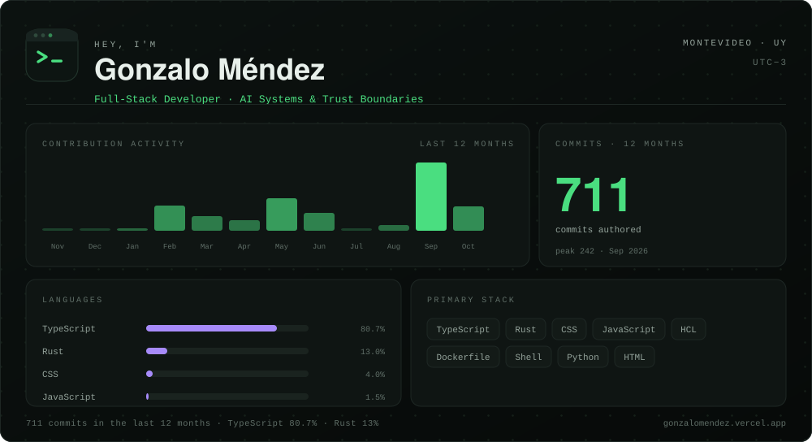

<samp><a href="https://gonzalomendez.vercel.app/">Site</a> &nbsp;·&nbsp; <a href="https://www.linkedin.com/in/gonzalomendezdev">LinkedIn</a> &nbsp;·&nbsp; <a href="mailto:gonzalomendezdev@gmail.com">Email</a></samp>

Full-stack engineer building AI systems that keep sensitive data on the machine.

Toolbox

**Interface** Tailwind CSS · TanStack Query · Framer Motion · Vite · Tauri
**Backend** Node.js · Express · REST API design · Java
**Data** PostgreSQL · MongoDB · Mongoose · Redis · OpenRouter · Zod
**Infrastructure** Turborepo · pnpm workspaces · Docker Compose · Vercel · Render · Cloudflare R2 · Paddle · HCL
**Security** JWT · Helmet · gitleaks · CSP · rate limiting · payload sanitization · SHA-256 integrity · signed updaters
**Practice** Git · GitHub Actions · Renovate · Playwright · Postman · Figma · Jira

